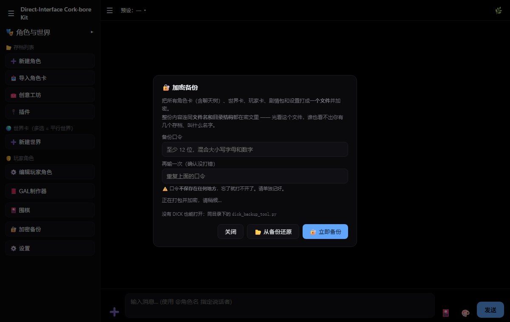
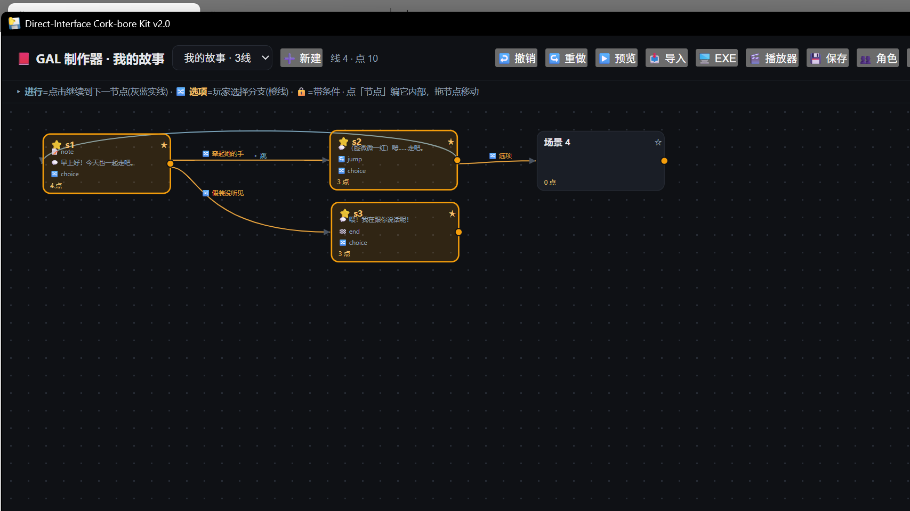

# Direct-Interface Cork-bore Kit（DICK）

> 本地 AI 角色扮演 / 交互叙事平台 · 树状记忆 · 机制养成 · 战斗系统 · CODEX 成作引擎
> **电脑**（Python + pywebview）· **手机**（Kotlin + Compose）· **原生播放器**（Compose Multiplatform）
> 免费 · 离线优先 · 数据全在你自己机器上





## English (short)

**DICK** (Direct-Interface Cork-bore Kit) is a **local-first AI roleplay / interactive-narrative platform** —
a lightweight alternative in the same sandbox as SillyTavern, focused on turning character cards into
playable things (choice-driven scenes, mechanics/affection systems, one-click story export).

- **Three targets, one spec:** Python + pywebview desktop · Kotlin/Compose Android · Compose Multiplatform
  native player (EXE & APK from the same codebase, not a web wrapper)
- **~86k lines** of source · **22 plugins** (declarative settings/UI, lifecycle + context hooks) ·
  **14 providers / 106 models** (incl. keyless & local Ollama) · **4 image-generation backends**
  (OpenAI-compatible, keyless Pollinations, local A1111, local ComfyUI)
- **Engineering discipline:** 64 test scripts / **1,583 assertions** run on Python 3.11 & 3.12 by GitHub
  Actions; 120 icons code-generated from a single dictionary into Android VectorDrawables with drift tests;
  battle formulas evaluated by an **AST whitelist (never `eval`)**; atomic-write save recovery; DPAPI-encrypted
  keys; encrypted `.dickbackup` container with a **standalone decrypt tool**
- **Runs from source:** `pip install -r requirements.txt` then `python "Direct-Interface Cork-bore Kit.py"`
  (Python 3.11/3.12, Windows)
- **Your data stays on your machine** · MIT licensed

> UI and docs are Chinese-first; English documentation is not available yet.
> Real-world feedback currently arrives over QQ rather than GitHub Issues — see the note near the bottom.

---

## 这是什么

**DICK**（全称 Direct-Interface Cork-bore Kit）是一个本地运行的 AI 角色扮演平台，和 SillyTavern（酒馆）是同一个沙盒的两种玩法：

- **DICK**：轻量、开箱即用，侧重"把角色卡变成能玩的东西"（GAL 选项 / 机制养成 / 一键成作）
- **酒馆**：硬核、插件生态深、折腾友好

两者角色卡互通：酒馆的卡（v1/v2/v3 / PNG 嵌卡）DICK 可直接导入，DICK 导出的卡（v2 JSON / PNG 嵌卡）酒馆可直接用。仓库自带酒馆安装器 `tavern-installer/`。

> ⚠️ 互通边界：转换保留人设（描述/性格/台词/开场白）与世界书；DICK 独有的树状记忆、机制卡（好感/状态/战斗）是扩展字段，转入酒馆时会被剥离，转回来需重新配置。

## 技术概览（给看代码的人）

| 维度 | 事实 |
|---|---|
| **规模** | 源码约 **86k 行**（Python 160 文件 / 44,386 行；Kotlin 60 / 16,040；JS 71 / 17,224；HTML 4 / 8,502，均排除依赖与构建产物） |
| **桌面端** | 单个 `HtmlApp` 类（6,659 行）对外暴露 **154 个 `api_*`**，经 pywebview js_api 桥接；前端是单页 `web/index.html`（8,119 行） |
| **三端实现** | 桌面（Python + pywebview）· 安卓（Kotlin + Compose）· 原生播放器（Compose Multiplatform，EXE 与 APK 同源） |
| **跨端一致性** | 120 个线性图标由 `web/index.html` 的 `ICONS` **单点生成** → `tools/gen_android_icons.py` → 108 个 Android VectorDrawable；两端各有防漂移测试（改一边忘了另一边会红） |
| **测试** | `tests/` **77 个独立脚本 / 2,233 次断言**（实跑汇总，2026-10）+ Node 图标回归 + 安卓 kotlinc 自检（`DICK-Android/selftest/run.ps1`：TextGuard + 机制重置 + 生活/空间对拍 45+277 条）+ 安卓分道执行的结构检查（`test_android_lanes.py`）+ 跨端对拍前置检查（`test_android_parity.py`：表是否最新 / 基准有没有被用到 / 接线有没有断）；GitHub Actions 跑 **三个作业：Linux(3.11/3.12) + Windows(3.12)**，任一失败即红。环境写进文件而不是靠记忆：`Dockerfile`/`.devcontainer`（本机一条命令跑 Linux 全套）、`tools/env_report.py`（一条命令看清跑测试的是哪套环境）、`tools/ci_dep_check.py`（装完自检，失败直接点名缺哪个包） |
| **插件架构** | 23 个插件类（4 个默认关闭，含 1 个协议示例）；声明式 `settings_schema` / `ui_buttons` 自动生成界面；钩子 `on_load/on_unload/on_message_send/on_message_received/contextInjection/on_command`；另有子进程 JSON-RPC 协议插件。**插件要界面走 `host_ui`**（宿主的原生文件对话框 + 聊天内提示），不许自带 GUI 库 |
| **生活层（吃饭）** | `life_core.py`：**世界时钟**（系统时间 = 1× 起源，累加虚拟秒）+ **厨具历史库**（10 个年代的工具表，卡住做法：史前没甑不能蒸、没铁锅不能炒）+ **食材/做法库**（辣椒番茄土豆玉米明末才传入）。菜单是确定性抽样（种子 = 角色\|世界第几天\|哪一餐）→ 重启/回档/换端一致，不需新增存档；每轮只注入 ≤240 字，角色卡 `advanced.life` 可单独覆盖年代/地域/口味/忌口 |
| **空间层（不能瞬移）** | `space_core.py`：**轮辐地图**（家为圆心，A→B 按经过家估，偏保守；`links` 可精确覆盖）+ 交通方式系数（走路 1.0 / 骑车 0.4 / 打车 0.35 / 高铁 0.06）+ **营业时间** + **家屋室内**（卧室/厨房… 0.5 分钟，不算赶路）。世界时间决定"来不来得及"：路费 > 那之后过去的世界时间就判穿帮，**照样记下新位置**、下一轮注入点名要求补交代（最多两次）。位置由模型用 `[loc:地名]` 标注（标签从显示文本剥掉，没机制卡也能用），另有 `/在哪`、`/空间` 命令与卡内 `advanced.space` 自定义地图 |
| **世界卡库 + 常识库** | `world_packs/`（受版本控制，`worlds/` 是被忽略的运行时目录）+ `commonsense.py`：**6 张成套世界卡**（现代都市/江南水乡·明末/仙侠·云梦宗/末世·废土/校园日常/赛博港区），每张带自己的地图、屋里格局、交通与年代参数；**12 种年代口径**（史前→现代 + 仙侠/末世）各有地点/交通/屋型表，与生活层的厨具食材年代表**同一批 key**（有测试断言不许漂移）。卡包**同名不覆盖**、覆盖前留备份；`/世界包` 列出/查看/装入 |
| **安全与可靠** | 战斗公式走 **AST 白名单求值**（绝不 `eval`）；存档 **原子写 + 备份 + 校验自愈**；API Key 用 Windows DPAPI 加密落盘；加密备份容器 `.dickbackup` **配独立解密工具**（没有 DICK 也能开自己的档） |
| **打包** | PyInstaller onedir + 自检流水线：包内 `web/index.html` 必须与源码一致且含 **16 个特征串**（专治打包缓存旧前端）；**不打包 Tcl/Tk**（Tk 时代遗产已清，每次发布少 ~3.5 MB 与一类窗口级故障） |
| **手机端对齐（生活 / 空间 / 世界卡库）** | 手机版原来只有聊天：同一个角色在电脑上"唐宋的江南、早上小米粥、骑车去码头"，换手机就变成没有日子、能瞬移、默认现代都市。现在这三层补齐了（`core/LifeCore.kt`、`SpaceCore.kt`、`WorldPacks.kt` + `/生活`、`/在哪`、`/世界包`）。**表只有一份真相**：`core/Tables.kt` 由 `tools/gen_parity.py` 从 Python 那几张表生成，手改/忘生成会被 `--check` 判过期（CI 跑这条）；**行为逐字对拍**：同一个脚本把电脑端结果冻成 `selftest/ParityGoldens.kt`（9 组、几十条：认年代、三餐含 720×、注入文本、地图快照、路费、够去哪、营业时间、标签解析、空间注入），`selftest/run.ps1` 第 3 步逐条比对。菜单能对拍是因为它确定性抽样 —— 为此 `core/PyRandom.kt` 逐位复刻了 CPython 的 `random.Random(字符串)`（含"key 数组低位在前"那个坑）。配置/状态文件名与字段和电脑端一致，数据目录可互读 |
| **世界记忆（演化）** | `world_memory.py`：把剧情里发生的**世界级事实**（"城南的桥塌了""宗门换了掌门"）沉淀成"这个世界现在是什么样"。**规则优先**抽取（问句/否定/未然/假设不记，"你不能这样"不算规则）；键 = `类别:主体`，**同一主体只留一条**、重复提及增强、冲突按时间**取最新**（桥先塌后修好 → 只留"修好了"，旧状态进 `prev_state`）。强度=「此刻多值得提醒」，按**那边的时间**衰减 `0.5**(世界天/半衰期)`（规则不衰减、地点/物品 30 天、组织/关系 7 天，门槛 0.35 = `salience.KEEP_THRESHOLD`）；淡出只是不进注入，档案不删、重提即回满、可 `/世界记忆 钉`。注入 `【世界·演化】` ≤240 字、插在【空间】之后，**只读**（重试不刷强度）。落 `memory/_world/<世界名>.json`（原子写、人可读）；`/世界记忆` 看/忘/钉/松/开/关/长/清。**清空聊天记录与回档时不清**（它与世界卡绑定，是另一条带） |
| **并发模型** | **模块分道执行**：电脑端 `jobs.py`（一个模块一条运行线 —— 对话/插件钩子/落盘保序（1 工作线程），网络 3 条、看图 2 条可并行；队列有上限（满了明确拒绝而不是堆内存），任务级超时、耗时与错误全部可见；异步结果走现有 poll 回前端，工坊那 8 个 `api_*` 已从"同步等"改为异步）；**手机端同一套想法**在 `Lanes.kt`（`io`/`vision`/`plugin` 各 1、`net` 4），主线程只负责"取快照"，整树序列化、机制状态、角色卡进出的写盘全在线里 |
| **多厂商** | 内置 14 家 / 106 个模型，含免 Key 免费链与本地 Ollama；生图引擎四种后端（OpenAI 兼容 / Pollinations 免 Key / 本地 A1111 / 本地 ComfyUI） |
| **文档** | 6 份使用与开发文档；其中《状态变量说明》与实现的一致性由测试锁定（改了代码不改文档会红） |

## 核心特性

### 聊天
- **树状记忆**：主线平铺、分支收纳，随时回溯任意节点；分支可折叠成「选项骨架」只看选项
- 多候选回复（滑条）、重生成、编辑消息（用户消息编辑开新分支，AI 消息原地改）
- **群聊**：多选角色即开聊，每个角色独立请求、**物理隔离**（各自的 system 只含本人人设），@角色名指定发言 + 自动接话
- 世界卡 / 世界书（关键词 / 正则 / 递归深度 / 权重 / 概率 / 常驻）/ **平行世界穿越**
- 上下文预算 4K–128K + 滚动摘要 + 记忆链归档（大存档自动分片，历史不丢）
- **离线推进**：你不在的时候世界自己走一小步 —— 回来时按「现实时长 × 时间流速」结算（好感缓慢下滑、数值状态回归、回合推进让事件冷却前进），先给方案再决定要不要应用，**应用错了可以一键撤销**

### 玩法
- **机制卡**：好感度（百分比制）/ 状态字段（int、enum）/ 事件触发（含冷却、次数、结局链）
- **战斗系统**：伤害公式走 AST 白名单求值（绝不 eval）、招式、buff，玩家与角色同规格
- **GAL 选项**：AI 生成剧情选项 + 隐藏 ROLL（坍缩 / 天选 / 暴击 / 稀有 / 大失败）。
  选项是按钮上的**短标签**，点下去发出去的是同一趟生成好的 **`say`**（补全成玩家第一人称的台词与动作）——
  记录里那句才像人说的话，而不是"温柔关心她"这种舞台指示；旧选项 / 模型没给 `say` 时自动退回标签
  （开关在插件设置里：`use_say`，默认开；两端同一套）
- **软件时间流速**：世界那边比现实快多少倍（对数表盘，10 ~ 1000 万倍），影响模型看到的时间上下文
- **UTAU 语音**：`[ja]` 日文配音（电脑端完整版 / 手机端系统 TTS）；UTAU 环境已内置，声库自备（`/voicebank` 导入，见 `声库安装说明.txt`）

### 成作（CODEX）
- 剧本 JSON（`codex/1.0` 开放格式）→ 一键打包**独立 HTML / EXE / `.codex` 包**（可分发、可卖）
- 傻瓜化导入素材（立绘/背景/音乐/配音）、AI 起草剧本、一键配音
- **`DICK-Narrative`**：Compose Multiplatform 写的**原生播放器**（EXE + APK 同源，不是网页套壳），与 GAL 制作器**零转换**互通

### 界面
- **120 个黑白线性图标，两端由同一份字典生成**：`web/index.html` 的 `ICONS` → `tools/gen_android_icons.py` → Android VectorDrawable。改一处两端都变，不存在"改了一边忘了另一边"
- 深色 / 浅色 / OLED 三套主题 + 四色强调色；文字与图标颜色全部跟随主题
- 手机端「彻底清空历史」= 机制状态回到初始值 **且重演一遍开场白**（状态如初，连第一句也在）

### 生图
- **一个入口，四种后端**：只改「生图端点」，后端自动认（也能手选，本地服务不在默认端口时用）
  | 端点 | 后端 | 要 Key 吗 |
  |---|---|---|
  | `https://image.pollinations.ai` | Pollinations | **不要**（免费公共档，会限流） |
  | `https://api.siliconflow.cn/v1` 等 | OpenAI 兼容（硅基流动 FLUX / 智谱 CogView / 任意中转） | 要 |
  | `http://127.0.0.1:7860` | 本地 A1111 / Forge / SD.Next（`/sdapi/v1/txt2img`） | 不要 |
  | `http://127.0.0.1:8188` | 本地 ComfyUI（`/prompt` + `/history` 轮询 + `/view`） | 不要 |
- **提示词分两层**：风格预设（自动拼前缀）+ 内容，另有「补充风格词」追加在末尾 —— 调提示词时不用重复敲风格
- **种子 + 🎲 重抽**：留空=随机，填了就能复现同一张；重抽=换个随机种子再来一张，挑到满意就把种子留下
- **预设可自己加**：设置 → 生图预设，写 `image_presets.json`（同名 id 覆盖内置预设），不写就用内置 6 套
- 出图直接进聊天（点输入框旁的 🎨），上次填的内容自动回填
- 免 Key 免费档的实测边界：**右下角带 pollinations.ai 水印**（`nologo=true` 去不掉），请求 1024 也可能只回 768 —— 要干净大图就填 Key 或走本地 SD

### 其他
- **插件系统**：20 个内置插件（Python 后端，含 1 个协议示例），`.py` 丢进 `plugins/` 即用，无商店无审核；**声明式**设置与界面按钮（写 `settings_schema` / `ui_buttons` 就自动生成 UI）；要文件对话框/提示就调 **`host_ui`**（宿主提供，插件不必自带 GUI 库）。标准见 `PLUGIN_DEV.md`；另有子进程 JSON-RPC 协议插件
- 正则管道（ai/user 作用域）、去 AI 味、文本/风格闸门（零宽字符防线）
- 财报助手（10 个官方政策源深爬 + 本地政策库 + 49 条金融史年表 1617–2026）、A 股技术面分析、联网搜索、日中互译、骰子、文档读写（Word/Excel）
- **多厂商**：内置 **14 家 / 106 个模型**（DeepSeek、OVH 免 Key 免费链、阿里百炼、智谱、硅基流动、Moonshot、火山方舟、百度千帆、MiniMax、阶跃星辰、OpenAI、Anthropic、Gemini、Ollama 本地），可自定义 base_url 与模型名；支持代理与中转

## 三端形态

```
             GAL 制作器（web/index.html 内嵌 · 线-点-分支编辑器）
                              │ 产出 codex.json + 素材
                              ▼
                    叙事引擎（同一份 scenes[]/lines[] 规格）
             ┌────────────────┼────────────────┐
             ▼                ▼                ▼
   DICK 主程序内嵌播放   DICK-Narrative    独立 HTML
                        （EXE / APK）
手机端 DICK-Android ⇄ 电脑端：角色卡/世界卡文件名即 ID，进度按时间戳后写胜同步
```

## 快速开始

### 电脑（release 包）
1. 解压 `DICK-电脑版.zip` → 双击 **`DICK-HTML.exe`**
   > ⚠️ 必须**整文件夹**使用：`DICK-HTML.exe` 与 `_internal/` 必须同级，不要只拷 exe
2. 首次启动弹欢迎页 → 填 API Key（DeepSeek 等；界面内有「去官网注册/充值」直达）
3. 左侧勾选角色 → 开始聊天（Ctrl/Shift 多选 = 群聊）

### 手机
- 安装 apk（debug 签名）→ 设置里填 API Key → 选角色开聊

### 从源码跑（电脑）
```bash
pip install -r requirements.txt
python "Direct-Interface Cork-bore Kit.py"
```

> 需要 **Python 3.11 / 3.12**（CI 两个版本都跑；开发环境为 3.11）。依赖清单见 `requirements.txt`，
> 其中 `flask` / `edge-tts` / `httpx` 是**可选**的（只影响侧车服务与日文 TTS，不装也能启动聊天）。
> 跑测试：`pip install -r requirements-test.txt` 后 `python tests/test_*.py`。

> `html_app.py` **不是入口**，它是 49 行的兼容垫片（供历史测试 `from html_app import HtmlApp` 用），直接运行它什么都不会发生。
> 源码运行**不会自带 API Key**：Key 存在 `config.json`，而它默认不进版本库（见「数据与隐私」）。

## 想玩酒馆？

```bash
cd tavern-installer
node install.js     # 或双击 install.bat
```
装完酒馆，你的角色卡两边都能用。

## 开发

### 目录导航

| 路径 | 干什么 |
|---|---|
| `Direct-Interface Cork-bore Kit.py` | **桌面入口**：单个类 `HtmlApp`（约 6000 行），对外暴露 154 个 `api_*` 供前端 js_api 调用 |
| `web/index.html` | 前端单页（约 8000 行）：聊天、GAL 编辑器、CODEX 编辑器/播放器、插件坞、图标字典 |
| `DICK_core.py` | 聊天核心：树状记忆、上下文裁剪、群聊隔离、机制/战斗结算的胶水层 |
| `image_gen.py` | 生图引擎：四种后端（OpenAI 兼容 / Pollinations 免 Key / 本地 SD / 本地 ComfyUI）+ 预设覆盖层 + seed |
| `codex_core.py` | CODEX 成作引擎（剧本解析 → 校验 → 独立 HTML / EXE / `.codex` 包） |
| `plugins/` | 19 个插件 + `protocol/` 协议插件（共 20 个）；插件要界面统一走 `host_ui.py` |
| `DICK-Android/` | 安卓端（Compose）：`core` / `app` / `plugins` / `tools` 四层 |
| `DICK-Narrative/` | Compose Multiplatform 原生 GALGAME 播放器（EXE + APK），故事格式见其 README |
| `tests/` | 77 个 Python 测试脚本（逐个独立运行）+ JS 图标回归 |
| `tools/` | `gen_android_icons.py`（图标 → VectorDrawable）、`gen_icon_preview.py`（图标总览页）、存档同步 |
| `tree_weight.py` `salience.py` `lookahead.py` `ranker.py` `rubric.py` | 记忆权重与剪枝 / 有损遗忘曲线 / 前瞻展开 / 排序器 / 价值判据 |
| `save_guard.py` `crypto_core.py` `dick_backup_tool.py` | 原子写+备份+校验自愈 / 加密备份容器 / 独立解密工具 |
| `net.py` `trpg_server.py` | 创意工坊服务端 / 跑团房间服务端（Flask，独立启动） |

### 命令

```bash
# 电脑
python "Direct-Interface Cork-bore Kit.py"           # 源码运行
python -m PyInstaller DICK_HTML.spec --noconfirm    # 打包 onedir EXE
python build_release.py --build                     # 清缓存 + 打包 + 自检 + 打 zip
python build_release.py                             # 已打包过：只做后处理/自检/打 zip

# 测试
python tests/test_*.py                              # 逐个跑（60 个脚本）
node tests/test_icons.js                            # 前端图标系统回归（需 Node）
powershell -File DICK-Android/selftest/run.ps1      # 安卓自检（TextGuard + 机制状态重置 + 生活/空间对拍）
python tools/gen_parity.py --check                 # 手机端的表/对拍基准是不是最新的（CI 也跑这条）

# 手机
cd DICK-Android && gradle :app:assembleDebug        # → app/build/outputs/apk/debug/

# 改过 web 的 ICONS 之后：重生成两端图标资源
python tools/gen_android_icons.py
python tools/gen_icon_preview.py                    # → _icons_preview.html，肉眼过一遍
```

### 发布流水线

`build_release.py` 做四件事：① 后处理（把 `tavern-installer` 从 `_internal/` 提到顶层 + 生成 `start.bat`）② **自检**：包内 `web/index.html` 必须与源码一致且含 16 个特征串（专治 PyInstaller 缓存旧前端）③ 打 zip 到 `../DICK-发布/DICK-电脑版.zip`（包内平铺，解压即用）④ 核对手机 apk 时间戳是否过期。

> ⚠️ 打包前**必须关掉正在运行的 `DICK-HTML.exe`**，否则它会锁住 `debug.log` 导致打包失败。
> ⚠️ 安装包：`build_installer.py` 需要 Inno Setup 与 `installer/DICK_Setup.iss`，**该目录未随仓库提供**，所以目前不产出 `DICK-Setup.exe`——直接用便携版 zip。

### 测试与 CI

`.github/workflows/test.yml`：push / PR 时在 **Python 3.11 与 3.12** 上逐个运行 `tests/test_*.py`，并跑一次 **Node 图标回归**；任一失败即红。安卓侧另有 `DICK-Android/selftest/`（kotlinc 直跑，不需要 Android SDK；路径写在该脚本顶部）—— 那份对拍需要 Kotlin 工具链，所以 CI 上跑的是它的**前置检查**：`tools/gen_parity.py --check`（表/基准是否与 Python 一致）+ `tests/test_android_parity.py`（基准有没有被真的用到、接线有没有断）。

## 数据与隐私

便携式设计：数据都在 exe 旁，不写注册表 —— `saves/`（角色卡与聊天树）、`worlds/`、`personas/`、`prompt_presets/`、`memory/`、`plugin_settings/`、`exports/`、`config.json`（全局设置与 API Key）、`image_presets.json`（自定义生图预设）。

`.gitignore` 已排除**存档、世界卡、玩家卡、插件设置、`config.json`、导出与缓存**，所以克隆下来是干净的；反过来说，**源码克隆没有 Key，首次启动需要自己填**。

## 文档

- `说明书.md` — 完整使用说明（安装 / 角色 / 世界 / 记忆 / 办公 / 财报 / 语音 / 命令大全 / FAQ）
- `PLUGIN_DEV.md` — 插件编写标准（钩子 / 声明式设置 / UI 按钮 / 访问 core / 调试发布）
- `状态变量说明.md` — 机制卡 / 战斗 / 好感度标签速查（给不写代码的人看）
- `待办与想法.md` — 未开工的方案与**已验证过的前提**（例：画面抓取/录屏联动的依赖现状与代价）
- `DICK-Narrative/README.md` — 播放器与 `codex/1.0` 故事格式规格
- `声库安装说明.txt` — UTAU 声库怎么找、怎么装

## 关于反馈与 Issue（为什么仓库里一条 Issue 都没有）

怕被误读成"没人用、也没人维护"，这里先说清楚：

- **这个项目是我一个人在持续开发、而且更新很勤**：功能、文档、测试、打包流水线都是同一个人在推；
  提交历史是连续的开发轨迹，不是一次性上传的存档。
- **为什么没有 Issue**：我的现实用户不在 GitHub 上——他们直接在 **QQ 里跟我描述"哪里不对劲/这是个 BUG"**，
  我照着描述**复现 → 定位 → 修 → 补一条回归测试 → 提交**（修 BUG 的过程会先在本地留取证截图，
  那些图含私人界面内容，不随仓库发布）。所以"没有 Issue"= 反馈走了私聊渠道，不等于没人提问题。
- **不代表不欢迎 Issue / PR**：欢迎提，附上 `debug.log`、复现步骤和版本号能省很多时间。
  只是要接受一个现实——**我可能回得慢**（一人项目，QQ 那边的反馈天然优先）。

## 已知边界

- **仅 Windows**（`secret_store.py` 用 DPAPI、打包用 PyInstaller、语音走 Windows 区域检测）；安卓端是独立实现
- 软件是个人学习项目，AI 回复由第三方模型生成，不代表本项目立场；财报/股票分析仅供参考，不构成投资建议
- 政策爬取只访问公开官方页面，请遵守目标站点条款

## 许可

MIT —— 自由使用、修改、分发。数据与作品归你自己。
